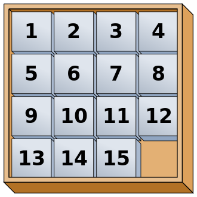

# Game of Fifteen

> Dit is een extra opdracht. De opdracht is een stuk pittiger dan andere onderdelen van de cursus, omdat je zelf meer uitzoekwerk moet doen. Los je de opdracht mooi op, dan krijg je een extra punt bovenop de beoordelingen van je normale inzendingen.
>
> Samenwerken bij de extra opdracht is niet toegestaan, maar gezamenlijk een probleemanalyse doen aan de hand van voorbeelden is helemaal prima. Je kunt voor deze opdracht géén hulp krijgen bij de assistenten.

Implement the Game of Fifteen, per the below.

    $ ./fifteen 3
    WELCOME TO GAME OF FIFTEEN

    8  7  6

    5  4  3

    2  1  _

    Tile to move:

## Background

The Game of Fifteen is a puzzle played on a square, two-dimensional board with numbered tiles that slide. The goal of this puzzle is to arrange the board's tiles from smallest to largest, left to right, top to bottom, with an empty space in board's bottom-right corner, as in the below.

{:.w-25}

Sliding any tile that borders the board's empty space in that space constitutes a "move."  Although the configuration above depicts a game already won, notice how the tile numbered 12 or the tile numbered 15 could be slid into the empty space. Tiles may not be moved diagonally, though, or forcibly removed from the board.

Commonly, the game starts with all numbers in a shuffled state. Because you will be implementing the game on a computer, you might be tempted to "randomize" all numbers before placing them on the board. Unfortunately, not every configuration of numbers is solvable! Your task is to present a player with a solvable configuration, lest we spoil the fun.

One way to get started is to position the board's tiles in reverse order, from largest to smallest, left to right, top to bottom, with an empty space in the board's bottom-right corner. *If, however, and only if the board contains an odd number of tiles (i.e., the height and width of the board are even), the positions of tiles numbered 1 and 2 must be swapped, as in the below.* The puzzle is solvable from this configuration.

{:.w-25}

Using this trick is a good way to get started. However, this configuration is decidedly *not random*, so eventually you will have to figure out how to create a reasonably random configuration.

## Distribution

### Downloading

    $ curl -O https://github.com/minprog/cs50x/raw/2021/fifteen/dist/fifteen.zip
    $ unzip fifteen.zip
    $ rm fifteen.zip
    $ cd fifteen
    $ ls
    3x3.txt     4x4.txt     Makefile    fifteen.c   questions.txt

### Understanding

> *How to get started* This problem is neatly divided into four separate functions that you have to implement. For each of those functions, you do a problem analysis. Keep in mind (after reading all of the explanations below) that there is one very important thing connecting those functions: the **data structure** that is called `board`. So first thing you do is deeply understand what the board is and how it stores almost everything that is important for implementing this game. Then, for each function, consider how the function's purpose relates to the board.

Take a look at `fifteen.c`. Within this file is an entire framework for the Game of Fifteen. The challenge up next is to complete this game's implementation.

But first go ahead and compile the framework. (Can you figure out how?) And, even though it's not yet finished, go ahead and run the game. (Can you figure out how?) Odds are you'll want to run it in a larger terminal window than usual, which you can open clicking the green plus (+) next to one of your code tabs and clicking *New Terminal*. Alternatively, you can full-screen the terminal window toward the bottom of CS50 IDE's UI (within the UI's "console") by clicking the *Maximize* icon in the console's top-right corner.

Anyhow, it appears that the game is at least partly functional. Granted, it's not much of a game yet. But that's where you come in!

## Specification

1. Implement the Game of Fifteen, per the comments in `fifteen.c` and the information from this specification.
1. Allow the game to generate **random** configurations. Your program needs to accept an optional command-line argument `-r` to do this.

    - Add a function `init_randomized` to generate a random configuration (see below for hints).
    - Adapt `main` to accept the `-r` command-line argument and call `init_randomized` instead of `init` when this command-line argument is provided.

## Questions

Read over the code and comments in `fifteen.c` and then answer the questions below in `questions.txt`, which is a (nearly empty) text file that we included for you inside of the distribution's `fifteen` directory. No worries if you're not quite sure how `fprintf` or `fflush` work; we're simply using those to automate some testing.

1. Besides 4 × 4 (which are Game of Fifteen's dimensions), what other dimensions does the framework allow?
1. With what sort of data structure is the game's board represented?
1. What function is called to greet the player at game's start?
1. What functions do you apparently need to implement?
{: start="0"}

## Walkthrough

[Open video on Youtube](https://www.youtube.com/watch?v=Rx_FJb3vr9U)

## Hints

Remember to take "baby steps." Don't try to bite off the entire game at once. Instead, implement one function at a time and be sure that it works before forging ahead. Any design decisions not explicitly prescribed herein (e.g., how much space you should leave between numbers when printing the board) are intentionally left to you. Presumably the board, when printed, should look something like the below, but we leave it to you to implement your own vision.

    15 14 13 12

    11 10  9  8

     7  6  5  4

     3  1  2  _

While a 3 × 3 board might look like the below:

    8  7  6

    5  4  3

    2  1  _

Feel free to tweak the appropriate argument to `usleep` to speed up animation. In fact, you're welcome to alter the aesthetics of the game. For fun with "ANSI escape sequences," including color, take a look at our implementation of `clear` and check out <http://isthe.com/chongo/tech/comp/ansi_escapes.html> for more tricks.

You're welcome to write your own functions and even change the prototypes of functions we wrote. But you may not alter the flow of logic in `main` itself so that we can automate some tests of your program once submitted. In particular, `main` must only return `0` if and when the user has actually won the game; non-zero values should be returned in any cases of error, as implied by our distribution code.

## Hints for randomizing

- You may start `init_randomized` by calling `init` to generate a guaranteed solvable configuration and then shuffle that randomly for some number of times.
- Or you may place numbers randomly, check the solvability of the generated configuration and if it's not solvable, generate another random configuration.
- Consult the [CS50 manual pages](https://manual.cs50.io) to find information on using the `random` and `srandom` functions.

## Testing

To test your implementation of `fifteen`, you can certainly try playing it. (Know that you can force your program to quit by hitting ctrl-c.) Be sure that you (and we) cannot crash your program, as by providing bogus tile numbers. And know that, much like you automated input into `find`, so can you automate execution of this game. In fact, we have provided you with `3x3.txt` and `4x4.txt`, winning sequences of moves for a 3 × 3 board and a 4 × 4 board, respectively. To test your program with, say, the first of those inputs, execute the below.

    ./fifteen 3 < 3x3.txt

### `check50`

Note that `check50` assumes that your board's blank space is implemented in `board` as `0`; if you've chosen some other value, best to change to `0` for ``check50``'s sake. Also note that `check50` assumes that you're indexing into `board` a la `board[row][column]`, not `board[column][row]`.

    check50 -l minprog/cs50x/2021/fifteen/random
